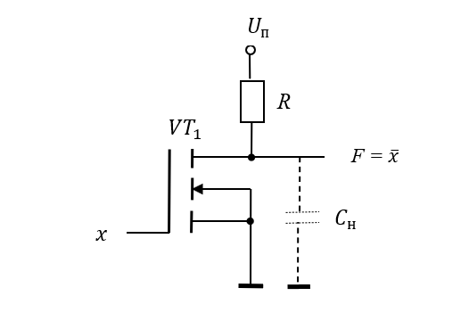
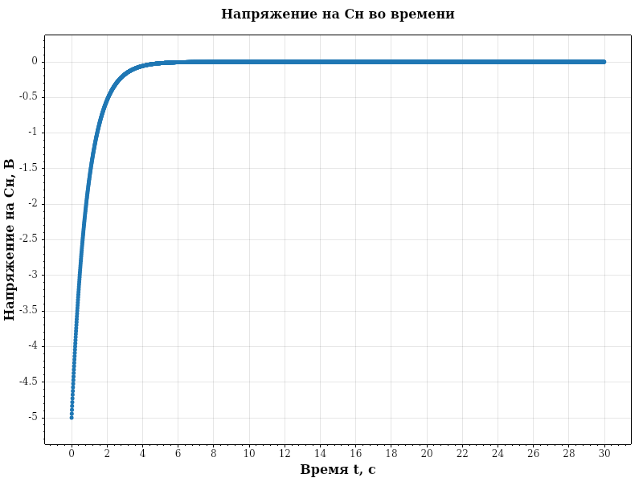
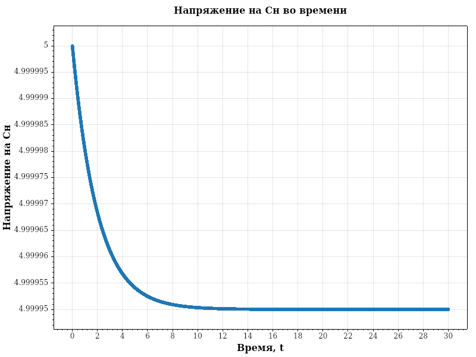
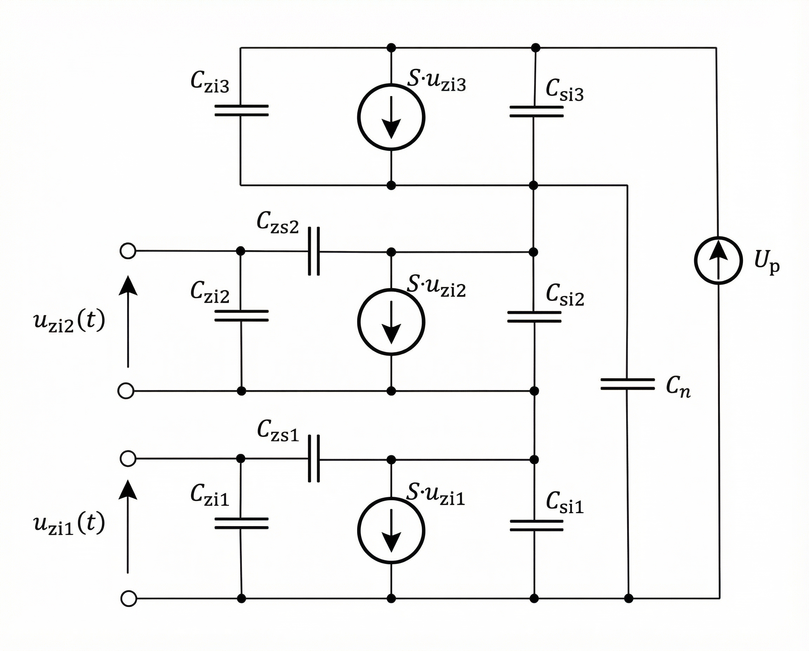
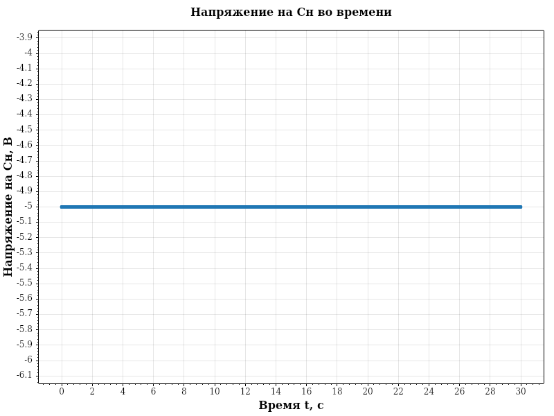
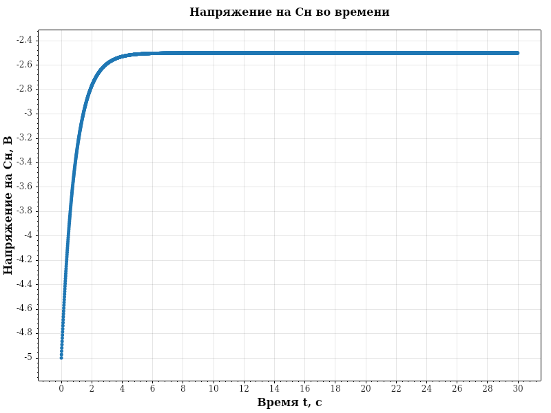

# Лабораторная работа №2

Рассмотрим данную схему. 
Принцип работы инвертора. 
X = 0 В (логический «0» на входе). Uзи = 0 < порогового напряжения - транзистор закрыт. Ток через VT почти не течёт. Через Rн на выход Y поступает почти полное напряжение питания: Y приблизительно равен +U (логический «1»). 
X = +U В (логический «1» на входе). Uзи = + U В > порогового напряжения - транзистор открыт. Сопротивление канала VT становится малым. Выход Y «притягивается» к земле через открытый транзистор: Y приблизительно равен 0 В (логический «0»). 
Итог: Y = ¬X (инверсия входного сигнала). 

Возьмем:

Cзс = 0.005 Ф

Cн = 0.003 Ф

Cси =  = 0.001 Ф

Cзи = 0.002 Ф

rси = 5000000 Ом

R = 100 Ом

S = 0.01 A/В

Uп = 5 В

Пусть Uзи = 5 В

Запускаем програму и получаем следующий график

Пусть Uзи = 0 В

Запускаем програму и получаем следующий график

# Лабораторная работа №3. Моделирование логического элемента НЕ-И

## НЕ И на транзисторах

1) X₁ = 0 В, X₂ = 0 В → VT1 закрыт, VT2 закрыт. Цепь от земли до Y разорвана. Через нагрузку выход Y подтягивается к +U → Y ≈ +U (логический «1»).
2) X₁ = 0, X₂ = 1 → VT1 закрыт, VT2 открыт. Цепь всё ещё разорвана (VT1 закрыт) → Y подтягивается к +U через нагрузку → Y = 1.
3) X₁ = 1, X₂ = 0 → VT1 открыт, VT2 закрыт. Цепь разорвана (VT2 закрыт) → Y = 1.
4) X₁ = 1, X₂ = 1. Оба транзистора открыты. Цепь от земли до Y замкнута → выход Y соединяется с землёй через открытые VT1 и VT2. Напряжение на Y близко к 0 В → Y = 0.

**Итог**: Y = ¬(X₁ ∧ X₂) - функция НЕ-И.

## О компоненте типа "G"

Компонент, обозначенный в программе **G**, представляет собой **источник тока, управляемый напряжением**

В контексте моделирования МДП-транзисторов этот элемент описывает зависимость тока стока от напряжения на затворе. Ток, генерируемый данным источником, не является фиксированной величиной, а вычисляется линейно в каждый момент времени по формуле:

$$I = S \cdot U_{вх}$$

где:
*   $S$ - крутизна характеристики
*   $U_{вх}$ - управляющее входное напряжение

## Результаты моделирования

Возьмем:

Cзс = 0.005 Ф

Cн = 0.003 Ф

Cси =  = 0.001 Ф

Cзи = 0.002 Ф

rси = 5000000 Ом

R = 100 Ом

S = 0.01 A/В

Uп = 5 В

Пусть Uзи1 = 0 В, Uзи2 = 0 В

Запускаем програму и получаем следующий график

Пусть Uзи1 = 5 В, Uзи2 = 5 В

Запускаем програму и получаем следующий график

Пусть Uзи1 = 5 В, Uзи2 = 0 В

Запускаем програму и получаем следующий график

Пусть Uзи1 = 0 В, Uзи2 = 5 В

Запускаем програму и получаем следующий график

